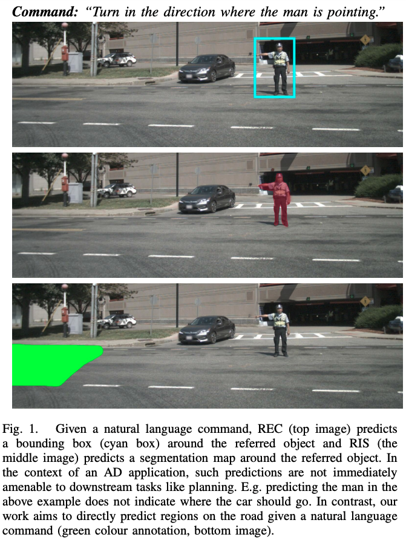

# Grounding Linguistic Commands to Navigable Regions (IROS 2021)

Official PyTorch implementation | [Paper](https://ieeexplore.ieee.org/document/9636172)

## Abstract
> Humans have a natural ability to effortlessly comprehend linguistic commands such as “park next to the yellow sedan” and instinctively know which region of the road the vehicle should navigate. Extending this ability to autonomous vehicles is the next step towards creating fully autonomous agents that respond and act according to human commands. To this end, we propose the novel task of Referring Navigable Regions (RNR), i.e., grounding regions of interest for navigation based on the linguistic command. RNR is different from Referring Image Segmentation (RIS), which focuses on grounding an object referred to by the natural language expression instead of grounding a navigable region. For example, for a command “park next to the yellow sedan,” RIS will aim to segment the referred sedan, and RNR aims to segment the suggested parking region on the road. We introduce a new dataset, Talk2Car-RegSeg, which extends the existing Talk2car [1] dataset with segmentation masks for the regions described by the linguistic commands. A separate test split with concise manoeuvre-oriented commands is provided to assess the practicality of our dataset. We benchmark the proposed dataset using a novel transformer-based architecture. We present extensive ablations and show superior performance over baselines on multiple evaluation metrics. A downstream path planner generating trajectories based on RNR outputs confirms the efficacy of the proposed framework.

## Dataset

Download [Talk2Car-RefSeg](https://drive.google.com/file/d/1kNEtbmV_777l8FxYig9WnxYH_E6W-4jH/view?usp=sharing) dataset

Test Split: [Talk2Car-RefSeg-test](https://drive.google.com/file/d/1MfqICRBlRNNC0YBqf48HeOkYjWtbt-Ft/view?usp=sharing)

## Dependencies

* Python: 3.8.5
* Pytorch: 1.7.1
* Torchvision: 0.8.2
* Wandb: 0.12.9 (for visualization)

## Training

    python main.py --batch_size 64 --num_workers 4 --optimizer AdamW --dataroot [Talk2Car-RefSeg path] --lr 3e-4 --weight_decay 5e-3 --image_encoder deeplabv3_plus --dataset talk2car --loss bce --dropout 0.25 --epochs 60 --power_factor 0.7 --num_encoder_layers 1 --image_dim 448 --mask_dim 448 --seq_len 40 --glove_path [glove_path] --mask_thresh 0.1 --area_thresh 0.4 --run_name baseline_drop_0.25 --save

## Citation

If you found our work useful to your research, please consider citing:

    @inproceedings{rufus2021grounding,
        title={Grounding Linguistic Commands to Navigable Regions},
        author={Rufus, Nivedita and Jain, Kanishk and Nair, Unni Krishnan R and Gandhi, Vineet and Krishna, K Madhava},
        booktitle={2021 IEEE/RSJ International Conference on Intelligent Robots and Systems (IROS)},
        pages={8593--8600},
        organization={IEEE}
    }
